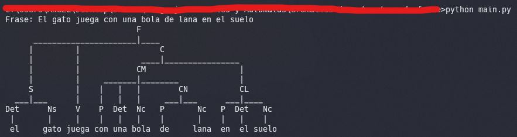

# Gramática de estructura de frase

---

1. [Introducción](#introducción)
1. [Instalación](#instalacion)
1. [Requisitos del sistema](#requisitos-de-sistema)
1. [Uso del programa](#uso-del-programa)
   - [Interfaz de usuario](#interfaz-de-usuario)
   - [Ejemplo de Uso](#ejemplo-de-uso)
   - [Testing](#testing)
1. [Soporte técnico](#soporte-técnico)
1. [Tiempo de respuesta](#tiempo-de-respuesta)
1. [Contribuidores](#contribuidores)

---

## Introducción

La gramática de estructura de frase (Phrase Structure Grammar, PSG) es un tipo de gramática generativa que describe la sintaxis de las lenguas naturales, es decir, cómo se forman las oraciones y frases en un idioma. Fue introducida por el lingüista Noam Chomsky en los años 50 y ha sido la base de muchas teorías lingüísticas desde entonces.

La PSG se basa en la idea de que las oraciones y frases se pueden dividir en partes más pequeñas, llamadas constituyentes. Por ejemplo, una oración simple en español podría dividirse en un sujeto y un predicado. Cada uno de estos constituyentes puede dividirse aún más, hasta llegar a las palabras individuales.

Este programa es solo para ejemplificar como se puede implementar una gramática de estructura de frase.

Basado en: https://github.com/calvinparks/parser

## Instalacion

1. Clona el repositorio:

   ```bash
   git clone https://github.com/angelchavezinformatica/sentence_structure_grammar.git
   cd sentence_structure_grammar
   ```

1. Ejecuta el siguiente comando para instalar las dependencias, (se recomienda usar un entorno virtual):

   ```bash
   pip install -r requirements.txt
   ```

1. Si es la primera ves que vas a usar el programa, ejecuta lo siguiente en el shell de python:

   ```pyhon
   import nltk
   nltk.download('punkt')
   ```

## Requisitos de Sistema

- Python 3.9 o superiores.
- Compatible con todos los sistemas operativos que puedan ejecutar python 3.

## Uso del Programa

### Interfaz de usuario

- Ejecutando el siguiente comando en el directorio del programa puede empezar a usar el programa.

  ```bash
  python main.py
  ```

### Ejemplo de Uso



### Testing

- Ejecutando el siguiente comando puede testear el programa.

  ```bash
  python main.py --test
  ```

## Soporte Técnico

### Plataforma de Soporte

- Correo Electrónico: achavezg@unitru.edu.pe

## Tiempo de Respuesta

Haremos todo lo posible para responder a tus consultas en un plazo de 48 horas.

¡Gracias por utilizar nuestro programa que implementa una Gramática de estructura de frase!

### Contribuidores

- Chávez García Angel Emanuel
- Mostacero Bazan Kevin Alejandro
- Sánchez Abanto Félix Aladino
